# Lab-Members
This is the introduction of the members of the PRCI-Lab
## Professors

### Josef Kittler 

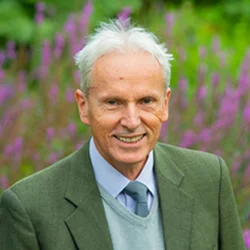

I have been a Research Assistant in the Engineering Department of Cambridge University (1973--75), SERC Research Fellow at the University of Southampton (1975-77), Royal Society European Research Fellow, Ecole Nationale Superieure des Telecommuninations, Paris (1977--78), IBM Research Fellow, Balliol College, Oxford (1978--80), Principal Research Associate, SERC Rutherford Appleton Laboratory (1980--84) and Principal Scientific Officer, SERC Rutherford Appleton Laboratory (1985).

I also worked as the SERC Coordinator for Pattern Analysis (1982), and was Rutherford Research Fellow in Oxford University, Dept. Engineering Science (1985).

I joined the Department of Electrical Engineering of Surrey University in 1986 as a Reader in Information Technology, and became Professor of Machine Intelligence in 1991 and gained the title Distinguished Professor in 2004.

### 吴小俊

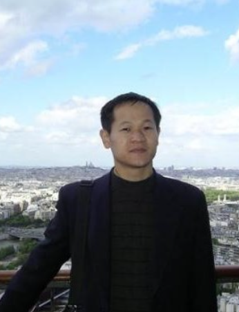

基本信息：吴小俊，江南大学二级教授、博导、科研院院长、至善教授。

研究方向：(1)硕士生

①学术型研究生招生专业：计算机科学与技术

主要方向：模式识别理论、方法及其应用，计算智能理论、方法及其应用，计算机视觉理论、方法及其应用，信息融合理论、方法及其应用。

② 专业型研究生招生专业：计算机技术

主要方向：模式识别理论、方法及其应用，计算智能理论、方法及其应用，计算机视觉理论、方法及其应用，信息融合理论、方法及其应用。

(2)博士生招生专业：

①控制科学与工程 研究方向：模式识别理论、方法及其应用，计算智能理论、方法及其应用，计算机视觉理论、方法及其应用，信息融合理论、方法及其应用。

主要成果：从事模式识别与人工智能方面的研究，承担包括IEEE智慧城市国际合作项目、国家自然科学基金联合基金重点项目、装备发展部预研项目、国家重点研发计划课题、国家自然科学基金面上项目、教育部重大科研项目和国防973子课题的研究。2006年教育部新世纪优秀人才、江苏省333工程领军人才。在国内外表学术论文300余篇，其中SCI论文100余篇、EI论文100余篇，出版学术著作5本（一本英文专著，CRC出版）。研究成果获得省部级以上奖励6项，其中包括国际会议最佳论文奖、IETE Gowri Memorial Award、教育部科技进步一等奖、合作者Josef Kittler院士获2015江苏省科学技术奖国际科技合作奖和2016中国政府友谊奖；主持国家精品课程《人工智能概论》和国家双语示范课程《人工智能》的建设工作，是计算机科学与技术国家特色专业点建设负责人和江苏省高校科技创新团队负责人。曾在英国、法国和港澳台地区留学和学术访问。曾担任多个国际和国内学术会议主席。担任IEEE智慧城市指导委员会委员、国际期刊International Journal of Computer Mathematics，Journal of Algorithm and Computational Technology，Frontiers in Neurorobotics，Computers in Biology and Medicine和SN Computer Science等的编委、教育部计算机类教学指导委员会委员、中国图像图形学会理事、江苏省人工智能学会副理事长、江苏省系统工程学会副理事长、中国航空学会信息融合专委会委员和无锡市计算机学会理事长等职。

E-mail：wu_xiaojun@jiangnan.edu.cn

Curriculum Vitae – X.J. Wu or Xiao-Jun Wu or Xiaojun Wu吴小俊

PhD. Distinguished Professor of Pattern Recognition & Computational Intelligence

School of Artificial Intelligence and Computer Science, Jiangnan University

Director, Institute of Science & Technology, Jiangnan University

1800 Lihu Avenue, Wuxi, Jiangsu, P. R. China

Email: wu_xiaojun@jiangnan.edu.cn, xiaojun_wu_jnu@163.com

Postcode: 214122

Xiao-Jun Wureceived his B.S. degree in mathematics from Nanjing Normal University, Nanjing, PR China in 1991 and M.S. degree in 1996, and Ph.D. degree in Pattern Recognition and Intelligent System in 2002, both from Nanjing University of Science and Technology, Nanjing, PR China, respectively. He was a fellow of United Nations University, International Institute for Software Technology (UNU/IIST) from 1999 to 2000. From 1996 to 2006, he taught in the School of Electronics and Information, Jiangsu University of Science and Technology where he was an exceptionally promoted professor. He joined Jiangnan University in 2006 where he is a distinguished professor of School of Artificial Intelligence and Computer Science, Jiangnan University. He won the most outstanding postgraduate award by Nanjing University of Science and Technology. He has published more than 300 papers in his fields of research, among which 100 papers have been indexed by SCI and more than 100 papers have been indexed by EI. He has won different awards including international award, national award and provincial award for his research achievements. He was a visiting postdoctoral researcher in the Centre for Vision, Speech, and Signal Processing (CVSSP), University of Surrey, UK from 2003 to 2004, under the supervision of Professor Josef Kittler. His current research interests are pattern recognition, computer vision, fuzzy systems, neural networks and intelligent systems. He was an associate editor of International Journal of Computer Mathematics. He is currently a review editor of Frontiers in Neurorobotics, and editor of Journal of Algorithm and Computational Technology, Associate Editor, Computers in Biology and Medicine, Associate Editor, SN Computer Science respectively. He is in charge of Wuxi IEEE Smart Cities Pioneering Program, IEEE Smart Cities Initiative.
### 方伟
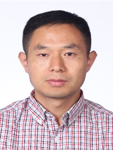

方伟教授、博导

江苏高校青蓝工程中青年学术带头人

江苏省“六大人才高峰”高层次人才

基本信息：2008年3月取得博士学位。2013年4月-2014年4月前往英国伯明翰大学(University of Birmingham)Xin Yao教授课题组(CERCIA)进行为期一年的学术访问。

研究方向：

智能优化理论、方法与应用

机器学习中的智能优化技术

大数据分析

复杂生产过程建模、优化与调度

①学术型研究生招生专业：模式识别与计算智能

主要方向：智能优化算法研究及应用

②专业型研究生招生专业：计算机应用技术

主要方向：①计算机优化算法②物联网技术应用

研究成果：主要以智能优化算法中的粒子群优化(Particle Swarm Optimization, PSO)算法和所在课题组提出的量子行为粒子群优化(Quantum-behaved PSO, QPSO)算法为研究对象，从这两种算法的理论和实际应用出发，对它们的理论基础及性能改进方法进行深入研究，并将它们应用在工程优化问题中。研究成果在国内外权威刊物发表论文60余篇，其中SCI(E)检索的论文30余篇，主要发表在《IEEE Transactions on Cybernetics》、《Information Sciences》、《Information Fusion》、《Evolutionary Computation》、《IEEE Transactions on Intelligent Transportation Systems》、《物理学报》、《控制与决策》、《系统工程与电子技术》以及智能计算相关的国际会议中。2011年由清华大学出版社出版专著《量子行为粒子群优化：原理及其应用》；作为主要撰写人，参与完成CRC出版社出版的英文学术专著“Particle Swarm Optimization: Classical and Quantum Perspectives”。主持国家重点研发计划子课题，国家自然科学基金面上项目、青年项目，江苏省重点研发计划、面上基金，中国博士后基金等项目，入选江苏省“六大人才高峰”高层次人才、江苏高校青蓝工程中青年学术带头人。现任国际刊物International Journal of Swarm Intelligence Research杂志编委（ESCI检索），International Journal of Computing Science and Mathematics(EI检索期刊)编委。曾获教育部高等学校科学研究优秀成果奖一等奖（大规模非线性智能建模与识别优化技术及其应用）、江苏省科学技术奖（基于计算智能的生物医学信息技术及其应用）、中国商业联合会科学技术奖一等奖（智能机器视觉优化技术研究及产业化应用）。

Email:fangwei@jiangnan.edu.cn

### 孙俊
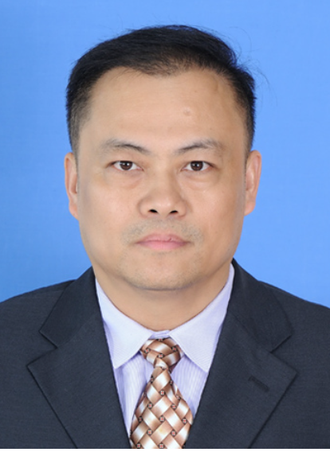

基本信息：孙俊，博士，江苏无锡人。2009年3月江南大学控制理论与控制工程专业博士研究生毕业，获得工学博士学位；2012年1月至2013年1月在英国牛津大学计算机科学系从事博士后研究；2013年10月至2015年8月由英国皇家学会资助，在英国牛津大学、考文垂大学从事高级访问研究员工作。2008年7月破格晋升副教授，2015年7月晋升教授。现任江南大学人工智能与计算机学院教授、博士生导师。
  研究方向：主要从事人工智能、计算智能、机器学习、大数据分析、生物信息学的研究以及人工智能、算法设计与分析、高性能计算的教学工作。入选2011年教育部新世纪优秀人才计划，2014年被评为无锡市优秀科技工作者,2019年入选江苏省青蓝工程优秀教学团队负责人。主持国家自然科学基金3（项面上项目2项和国际合作交流项目1项），教育部新世纪优秀人才计划项目1项，江苏省自然科学基金1项，教育部装备预研项目1项。参与国家自然科学基金3项，国家科技部重点研发项目2项，国家工信部项目1项，其它省部级以上项目5项。
  主要成果：在《Evolutionary Computation》、《Machine Learning》、《IEEE/ACM Transactions on Computational Biology and Bioinformatics》、《IEEE Transactions on Circuits and Systems》、《IEEE Transactions on Industrial Informatics》等国际权威期刊上发表SCI论文70余篇；论文总引用8200余次(google scholar)，单篇论文最高被引用1770次（google scholar），H指数为37（google scholar），单篇论文SCI他引400余次（不完全统计）。出版中英文专著各一部（英文专著CRC出版社）。获教育部高校科技进步一等奖1项，江苏省科学技术三等奖1项，其它部级科技进步一等奖1项，二等奖2项，三等奖3项。授权国家发明专利8项，软件著作权12项。担任国家网络教育精品课程《人工智能概论》主讲教师，国家级双语示范课程《人工智能》主讲教师。主编江苏省高校重点教材2本（《高性能计算》和《人工智能导论》）。担任国际期刊《Journal of Algorithms & Computational Technology》副主编，《IEEE Transactions on Evolutionary Computation》、《IEEE Transactions on Cybernetics》等国际期刊的审稿人以及多次担任国际学术会议的程序委员会委员。
在研项目：
(1)求解大规模数据分析中复杂优化问题的演化算法研究，国家自然科学基金面上项目（主持）
(2)互联网食品销售违法违规风险大数据监管平台，国家重点研发项目子课题任务（主持）
(3)人工智能与物联网应用课程教学团队，江苏省青蓝工程优秀教学团队（主持）
(4)粮食产后运输与存储环节损耗智能评估，企业横向（主持）
(6)行为大数据模式识别理论与方法，国家自然科学基金联合基金重点项目（参与）
(7)面向复杂任务的数据表示技术，装备预研项目（参与）

Email： sunjun_wx@hotmail.com，junsun@jiangnan.edu.cn

### 宋晓宁
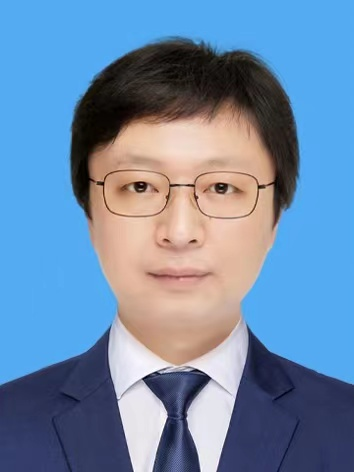

基本信息：宋晓宁，博士、江南大学教授、博士生导师。入选江苏省“333高层次人才”中青年学术带头人、江苏省“六大人才高峰”。2010年10月毕业于南京理工大学模式识别与智能系统专业，获工学博士学位。2011年5月至2014年5月在南京理工大学从事博士后研究。2014年6月至2015年6月在英国Surrey大学电子工程系视觉、语音和信号处理中心(Centre for Vision, Speech and Signal Processing)担任访问学者，合作导师：英国皇家工程院院士、原国际模式识别协会(IAPR)主席Josef Kittler教授。

研究方向：

(1)硕士研究生

学术型研究生招生专业：计算机科学与技术

研究内容：①模式识别理论、方法及应用；②图像分析与机器视觉；③声音及自然语言处理；④生物信息学

专业型研究生招生专业：计算机技术

研究内容：①模式识别理论、方法及应用；②图像分析与机器视觉；③声音及自然语言处理；④生物信息学

(2)博士研究生

控制科学与工程招生专业研究方向：模式识别与智能系统、机器视觉、自然语言处理

主要成果：主要在计算机视觉、自然语言处理以及生物信息领域从事研究工作。近年在国际权威学术期刊和顶级学术会议《IEEE Trans. on Cybernetics》，《IEEE Trans. on Information Forensics and Security》，《IEEE Trans. on Neural Networks and Learning Systems》，《Annual Meeting of the Association for Computational Linguistics》等以第一/通讯作者发表学术论文26篇，其中中科院一区/二区以上论文17篇，含6篇TOP期刊与顶级会议。主持国家自然基金面上项目、江苏省自然基金面上项目、中国博士后基金特别资助、国家重点研发计划子课题等各类课题20余项，授权发明专利10项，部分研究成果得到产业应用。获得省部级科技进步奖5项和江苏省教学成果奖二等奖1项。

现任中国人工智能学会模式识别专委会委员，中国计算机学会计算机视觉专委会委员，江苏省人工智能学会模式识别专委会和机器学习专委会委员。长期担任《IEEE Trans. on Cybernetics》，《IEEE Trans. on Image Processing》，《IEEE Trans. on Neural Networks and Learning Systems》，《IEEE Trans. on Circuits and Systems for Video Technology》，《Pattern Recognition》等20余个国际学术期刊审稿专家。

主持科研项目：

1.国家自然科学基金面上项目(61876072)，非限制人体生物视频特征中的欺诈与反欺诈技术研究，2019.1-2022.12，主持，在研。

2.江苏省自然科学基金面上项目(BK20161135)，面向多源图像的深度特征表达与融合理论及其应用，2016.7-2019.7，主持，结题。

3.国家重点研发计划子课题(2017YFC1601800)，面向机器学习的食品安全事故因素发现与分类技术，2018.1-2021.12，主持，在研。

4.中国博士后科学基金特别资助(2018T110441)，生物视频特征中的欺诈与反欺诈技术研究，2018.6-2020.6，主持，结题。

5.中国博士后科学基金一等资助(2016M590407)，图像非传统字典局部形态最优协同性研究及其应用，2016.05-2019.05，主持，结题。

6.江苏省“六大人才高峰项目”(XYDXX-012)，大规模多源异质图像数据协同关联分析与立体表征，2017.10-2019.10，主持，在研。

7.高维信息智能感知与系统教育部重点实验室(JYB201603)，大规模图像局部形态最优协同性研究及其应用，2016.1-2017.12，主持，结题。

8.浙江大学CAD&CG国家重点实验室开放课题(A1418)，自适应非局部形态邻域正则化信号重建理论及其图像应用，2014.1-2015.12，主持，结题。

9.南京信息工程大学中美计算机科学研究中心开放基金课题，大规模多源图像深度协同理论及其应用，2016.9-2017.9，主持，结题。

10.福建省信息处理与智能控制重点实验室开放基金课题(MJUKF201709)，面向姿态不变性的大规模图像稀疏协同分类方法，2017.1-2018.12，主持，在研。

11.江苏省高校自然科学研究项目(10KJB520006)，特征空间中的类别聚合理论研究及其在图像识别中的应用，2010.10-2012.12，主持，结题。

12.中国博士后科学基金(2011M500926)，面向高维特征的层级结构聚合理论与关键技术，2011.10-2013.12，主持，结题。

13.江苏省博士后科学基金(1102063C)，面向高维图像的区域空间关系描述理论及其应用研究，2012.01-2013.12，主持，结题。

14.人工智能四川省重点实验室开放基金重点课题(2012RZY02)，多粒度稀疏表示理论及其在图像反问题中的应用研究，2012.10-2014.9，主持，结题。

15.计算智能与信号处理教育部重点实验室开放课题，基于形态尺度的压缩感知正则化模型及其应用，2013.3-2015.3，主持，结题。

完成工业项目：

1.公安监所异常行为检测，江苏正德厚物联网科技发展有限公司，2021.

2.胃镜胶囊AI辅助诊断系统，无锡安之桌医疗机器人有限公司，2020.

3.国安涉密项目（*****），北京联想集团公司，2019.

4.微世检验智能显微镜AI部分（一期），第牛（上海）健康科技有限公司，2019.

E-mail：x.song@jiangnan.edu.cn/song_xiaoning_jnu@163.com

### 毛力

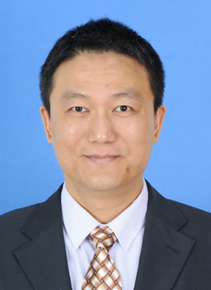

基本信息：毛力，男，1990年本科毕业于东南大学计算机科学与工程系，东华大学计算机应用技术硕士，现任江南大学人工智能与计算机学院教授，硕士生导师。
研究方向：人工智能、计算机网络及水产健康养殖。
学术型硕士研究生招生专业：计算机科学与技术
主要方向：人工智能与模式识别,计算机网络。
专业型硕士研究生招生专业：计算机技术
主要方向：水产健康养殖，物联网技术应用。
主要成果：主持和参与国家级项目四项，省部级项目三项；获得省部级奖项五项；两次被评为校优秀教育工作者，一次被评为校师德标兵。近年主持和参与的主要项目如下。
1、“十二五”农村领域国家科技计划子项目，水产品加工过程中安全危害的现场识别检测技术-水产品加工过程中危害因素的识别与脱除技术研究（主持）。
2、国家自然科学基金面上项目，求解大规模数据分析中复杂优化问题的演化算法研究（参与）。
3、国家重点研发项目子课题任务，互联网食品销售违法违规风险大数据监管平台（参与）。
4、江苏省产学研合作项目，基于信息融合技术的农业面源污染监测及预警系统（主持）。
5、中国水产科学研究院淡水渔业研究中心委托项目，罗非鱼养殖池塘水质监测预警系统的开发与研究（主持）。
6、中国水产科学研究院淡水渔业研究中心委托项目，罗非鱼良种养殖环境因子预测研究（主持）。
Email：wxmaoli@163.com

### 罗晓清
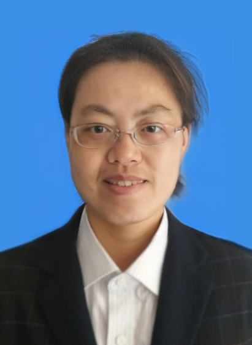

个人简介
2010年12月取得博士学位。2015年8月-2016年8月前往英国萨里大学CVSSP研究中心(the Centre for Vision, Speech and Signal Processing, University of Surrey, University of Surry) Prof. Josef Kittler教授课题组进行为期一年的学术访问。主要研究方向包括信息融合、机器视觉、医学图像处理、目标识别与跟踪等。研究成果在国内外权威刊物发表论文60余篇，其中SCI(E)检索的论文20余篇。
主持国家自然科学基金面上项目、青年项目，总装预研教育部联合项目，中央军委科技委项目，江苏省自然科学基金，中国博士后基金，江苏省博士后基金，教育部中央高校专项重点等项目，主持多项医学图像处理、视觉检测等企业委托项目，入选江苏省“六大人才高峰”高层次人才。先后获得省部级科技进步奖4项，授权发明专利4项，软件著作权20余项，江南大学教学成果奖一项。现为IEEE,中国计算机学会会员，江苏省人工智能学会会员，江苏省人工智能模式识别专委会委员。国家自然科学基金、教育部学位与研究生教育评估论文评审专家
研究方向
-信息融合
-医学图像处理
-机器视觉
主讲课程
研究生：计算机视觉原理与应用
本科生：操作系统、Linux环境程序设计
研究生教育
学术型研究生招生专业：
①计算机科学与技术研究方向：信息融合、机器视觉和医学图像处理；
专业型研究生招生专业：
①计算机技术研究方向：信息融合、机器视觉、医学图像处理及相关软件研发；
联系方式
通信地址：江苏省无锡市蠡湖大道1800号江南大学物联网工程学院
邮编：214122
Department of Computer Science, School of IOT Engineering, Jiangnan University
No. 1800, Lihu Avenue, Wuxi, Jiangsu, China 214122
Email: xqluo@jiangnan.edu.cn

## Associate Professors
### 陈志国
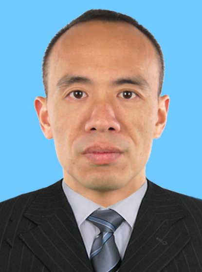

基本信息：陈志国，博士，副教授、硕士生导师。
研究方向：主要从事传感器技术、嵌入式系统设计与应用、计算机智能控制等方面的研究和教学工作。
（1）硕士生学术型研究生招生专业：计算机科学与技术
主要方向：智能传感技术，嵌入式系统应用，计算机智能控制。
（2）专业型研究生招生专业：计算机技术
主要方向：计算机应用技术，计算机信息管理，软件设计方法与应用。
主要成果：目前已在国内外权威刊物上发表论文20多篇，其中SCI（E）检索的论文6篇，EI检索的论文5篇，参与申报国家科技支撑计划1项、863项目1项，参与教育部科学研究重大项目1项、973军工子项目1项、江苏省产学研联合创新资金项目1项，承担企业研究项目30多项，获得中国轻工业联合会科技进步奖二等奖1项、中国轻工业联合会科技进步奖三等奖1项、无锡市科技进步奖三等奖1项，目前为IEEE、ACM、CCF会员，以及《International Journal of Pattern Recognition and Artificial Intelligence》、《Information Sciences》等国际期刊审稿人。
Email：chenzg@jiangnan.edu.cn

### 张涛

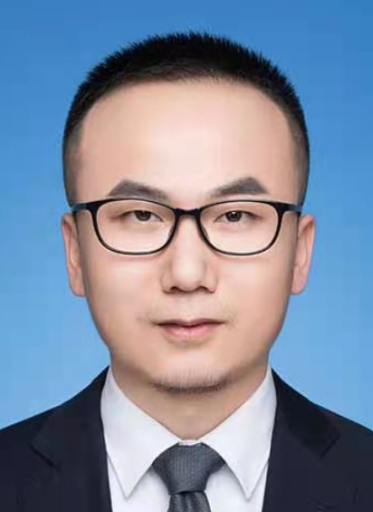

基本信息：张涛，博士，副教授，硕士生导师，1985年6月生。2016年3月于上海交通大学教育部重点实验室，模式识别与智能系统专业毕业，获工学博士学位，导师：杨杰。2015年4月至2015年10月在澳大利亚悉尼科技大学电子工程系全球大数据中心(Global Big Data Technologies Centre (GBDTC) at the University of Technology Sydney (UTS))做访问学者。现任江南大学人工智能与计算机学院计算机系副教授。
研究方向：主要从事模式识别、机器学习和计算机视觉的研究和教学工作。
(1)学术型研究生招生专业：
计算机科学与技术 主要方向：数据融合、模式识别、计算机智能控制系统及软件开发与应用，计算机生物建模。设计与开发以及基于计算机的生物大分子建模与优化。
主要成果：在国内外重要学术期刊《IEEE IOT》、《IEEE Transactions on Industrial Informatics》、《IEEE Transactions on Circuits and Systems for Video Technology》，《Pattern Recognition Letters》,《Neurocomputing》，《Applied intelligence》，《Biocybernetics and Biomedical Engineering》，《Multimedia Tools and Applications》等以第一作者发表学术论文20余篇，其中SCI检索10篇、EI检索10篇。授权发明专利2项、软著2项。主持国家自然科学基金、江苏省自然科学基金、博士后基金等多项国家及省部级项目。现为IEEE、中国图形图形学会会员。
在研和已完成的科研项目：
(1)国家自然科学基金青年项目，61702226，面向暴力行为识别的深度特征联合稀疏表示关键算法研究，2018/01-2020/12，在研，主持。
(2)江苏省自然科学基金青年项目，BK20170200，基于深度特征提取和稀疏表示的暴力行为识别研究，2017/07-2020/06，在研，主持人。
(3)国家自然科学基金面上项目，61572315，基于图的半监督学习的快速鲁棒算法研究及其应用，2016/01-2019/12，在研，主要参与人。
(4)国家自然科学基金青年基金项目，61503243，面向智能机器人柔性装配系统自主控制的主动视觉感知技术研究，2016/01-2018/12，在研，主要参与人。
(5)国家973计划(2015CB856004)子课题“图像数据的处理与统计学习”, 2015.1-2018.12，主要参与人，结题。
(6)国家863计划子课题“光学复合仿生视觉关键技术及验证系统研究”，2013.1-2016.12，主要参与人，结题。
(7)国家自然科学基金国际(地区)合作与交流项目（61411130135，F030403）“视觉显著性和不变性特征提取的合作研究”，2011.1-2014.12，主要参与人，结题。
(8)博士点科研基金（20120073110018）“面向多模态数据的异常行为分析算法研究”，2019.12-现在，主持，在研。
(9)国家自然科学基金项目（61273258）“多视频摄像头组网协同下目标检测分析的关键技术研究”，2012.1-2015.12，主要参与人，结题。
(10)上海市国际科技合作基金项目“智能化网络图像搜索技术和平台的合作开发与应用”（11530700200），2013.3-2015.3，主要参与人，结题。
(11)华为公司视频监控项目，2011.01-2014.12，主要参与人，已完成。
(12)华为公司监控目标搜寻项目，2011.09-2014.12，主要参与人，已完成。
(13)图像检索和场景重建项目，2011.11-2013.7，主要参与人，已完成。
(14)北信源视频监控项目，2013.9-2015.3，负责人，已完成。
(15)上海某公司美肤项目，2014.10-2015.6，负责人，已完成。
(16)图像处理软件开发，2013.6-2014.9，主要参与人，已完成。
现担任《Transactions on Intelligent Transportation Systems》、《Pattern Recognition Letters》,《Applied Soft Computing》,《Neurocomputing》，《Appliedintelligence》，《medical & biological engineering & computing (mbec)》等多个国际重要期刊审稿专家。
E-mail：taozhang@jiangnan.edu.cn

### 胡聪
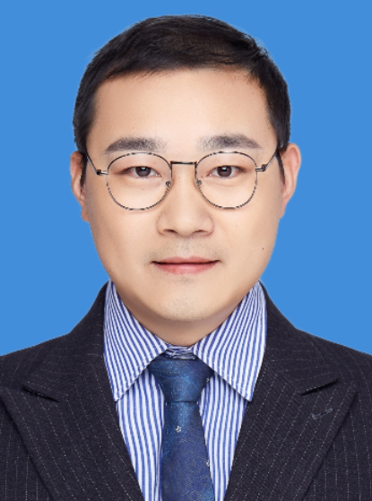

基本信息：胡聪，博士，副教授，硕士生导师。1987年出生，2019年江南大学轻工信息技术专业获工学博士学位。2018-2019年在英国萨里大学电子工程系视觉、语音和信号处理中心(University of Surrey, CVSSP)博士联合培养。现任江南大学人工智能与计算机学院副教授，人工智能系副系主任。
研究方向：人工智能、模式识别、计算机视觉。
（1）学术型研究生招生专业：计算机科学与技术。
主要研究方向：模式识别、弱/无监督学习、对抗机器学习。
（2）专业型研究生招生专业：计算机技术。
主要研究方向：深度学习、计算机视觉、模式识别理论及应用。
主要成果：主要从事人工智能、模式识别、计算机视觉等领域的研究和教学工作。已在国内外权威期刊及会议发表论文10余篇。主持国家自然科学基金青年项目，江苏省自然科学基金青年项目，中国博士后科学基金面上项目和多项企业合作项目，参与国家自然科学基金联合基金等国家级项目多项。现为中国计算机学会会员，无锡市人工智能学会副秘书长，IEEE TNNLS等多个国际权威期刊的常用审稿人。
联系方式：conghu@jiangnan.edu.cn

### 徐天阳
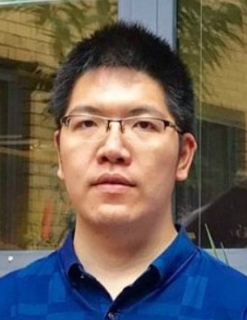

基本信息：徐天阳，男，博士，副教授。2011年于南京大学电子信息科学与技术专业获学士学位；2019年于江南大学模式识别与智能系统专业获博士学位；2018-2019年于英国萨里大学电子工程系视觉、语音和信号处理中心(Centre for Vision, Speech and Signal Processing, CVSSP)博士联合培养；2019-2021于CVSSP担任Research Fellow。现任江南大学人工智能与计算机学院计算机系副教授。
研究方向：模式识别、计算机视觉、人工智能。主要包括图像增强、视频理解、跨模态学习、流形学习。
主要成果：发表学术期刊和会议论文40余篇，包括IJCV、TIP、ICCV、AAAI、TIFS、TKDE等；获中国图象图形学学会优秀博士学位论文奖；获相关国际学术竞赛冠军，包括VOT2018 public dataset (ECCV18), VOT2020-RGBT challenge (ECCV20), Anti-UAV challenge (CVPR20), MMVRAC Skeleton-based Action Recognition (ICCV21), MMVRAC Fisheye Video-based Action Recognition (ICCV21)；
个人学术主页：https://xu-tianyang.github.io/
个人联系方式：tianyang_xu@163.com

### 陆恒杨
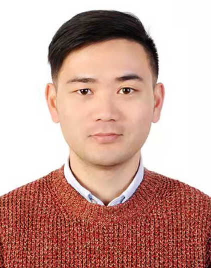

基本信息：陆恒杨，博士，副教授。1991年出生，2019年南京大学计算机科学与技术专业获博士学位，同年任职于江南大学。现任江南大学人工智能与计算机学院副教授。
研究方向：人工智能，数据挖掘，自然语言处理。
（1）学术型研究生招生：
主要研究方向：数据挖掘、少样本机器学习、自然语言处理。
（2）专业型研究生招生：
主要研究方向：深度学习、数据挖掘、模式识别理论及应用。
主要成果：已在AAAI、COLING等国内外权威期刊及会议发表论文20余篇。主持国家自然科学基金青年项目，中国博士后科学基金面上项目等，入选江苏省双创博士，以主要成员身份参与国家自然科学基金联合基金等多项国家级项目。现为中国计算机学会会员、中文信息学会会员。担任多个国际权威期刊和会议的常用审稿人。
联系方式：luhengyang@jiangnan.edu.cn

## Lecturers
### 李辉
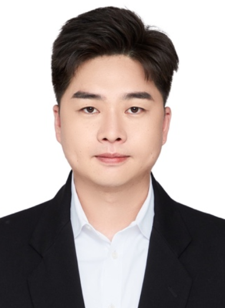

基本信息：李辉，博士，讲师。1992年出生，2022年1月获江南大学控制科学与工程专业工学博士学位，同年任职于江南大学。个人主页https://hli1221.github.io/
研究方向：模式识别，计算机视觉，多模态信息融合，图像处理等。
学术型研究生招生专业：计算机科学与技术
专业型研究生招生专业：计算机技术、人工智能
主要成果：在IEEE TPAMI，IEEE TIP，Information Fusion，IEEE TCYB，IEEE TIM，ICPR等国内外权威期刊及会议发表论文20余篇，谷歌学术被引次数2600+。获得多项国际学术竞赛奖项，包括2020年国际视觉目标跟踪竞赛RGBT组（VOT-RGBT）冠军，2021年国际反无人机竞赛（Anti-UAV）季军。主持国家自然科学基金青年项目，以主要成员身份参与国家自然科学基金联合基金重点项目、国际合作重点项目、军委装备发展部预研项目等多项国家级项目。入选斯坦福大学2022年度全球前2%顶尖科学家榜单（https://elsevier.digitalcommonsdata.com/datasets/btchxktzyw/4）。
联系方式：lihui.cv@jiangnan.edu.cn，hui_li_jnu@163.com

### 李超

基本信息：李超，博士，讲师。1990年出生，2022年获江南大学控制科学与工程专业工学博士学位，同年任职于江南大学。2018-2019年作为联合培养博士生在英国考文垂大学学习交流。现任江南大学人工智能与计算机学院讲师。
研究方向：主要从事计算智能，机器学习，高性能计算，生物信息等领域的研究和教学工作。
（1）学术型研究生招生方向：计算机科学与技术
（2）专业型研究生招生方向：计算机技术、人工智能
主要成果：已在国内外权威期刊及会议发表论文10余篇。主持江苏省自然科学基金青年项目和多项企业合作项目，以主要成员身份参与国家自然科学基金联合基金等国家级项目多项。
联系方式：chaoli@jiangnan.edu.cn

### 朱书伟

基本信息：朱书伟，博士，讲师。2021年12月获得同济大学博士学位，并于2019-2021受国家留学基金委资助赴美国密歇根州立大学联合培养两年，2022年1月入职江南大学。
研究方向：演化学习与智能优化、机器学习、数据驱动优化、数据挖掘等。
学术型研究生招生专业：计算机科学与技术
专业型研究生招生专业：计算机技术、人工智能
主要成果：已在IEEE TCYB、IEEE TEVC、KBS、ESWA、计算机研究与发展等国内外权威期刊及会议发表论文10余篇，主编学术专著一本。现主持国家自然科学基金青年项目一项、江苏省自然科学基金青年项目一项、以及企业横向项目一项，主要参与国家自然科学基金面上项目、教育部-中国移动重大项目、研究所（企业）项目多项。担任多个国际期刊和会议的审稿人。
联系方式：zhushuwei@jiangnan.edu.cn

### 张东霖

基本信息：张东霖，博士，2022年1月入职江南大学，现任人工智能与计算机学院讲师。
研究方向：人工智能、模式识别、多媒体计算、食品计算。
学术型研究生招生专业：计算机科学与技术
专业型研究生招生专业：计算机技术、人工智能
研究成果：已在TKDE,TCYB,TSMC,TOMM,TIST及PR等国际期刊或会议上发表论文十余篇。主持国家自然科学基金青年项目及企业（研究所）横向多项，参与国家自然科学基金联合基金等国家级项目多项。现为IEEE、ACM、中国计算机学会、中国图像图形学会会员。担任多个国际期刊和会议审稿人。
联系方式：zhangdlin@jiangnan.edu.cn

### 刘哲

基本信息：刘哲，博士，讲师。1996年出生，2021年新南威尔士大学计算机科学与工程获博士学位，2022年任职于江南大学。现任江南大学人工智能与计算机学院讲师。
研究方向：深度学习，数据挖掘，小样本机器学习，计算机视觉等。
专业型研究生招生专业：计算机技术、人工智能。
主要成果：已在AAAI、KDD、TNNLS、TCSVT、TMM等国内外权威期刊及会议发表论文10余篇。担任多个国际权威期刊和会议的常用审稿人。
联系方式：8202207028@jiangnan.edu.cn

